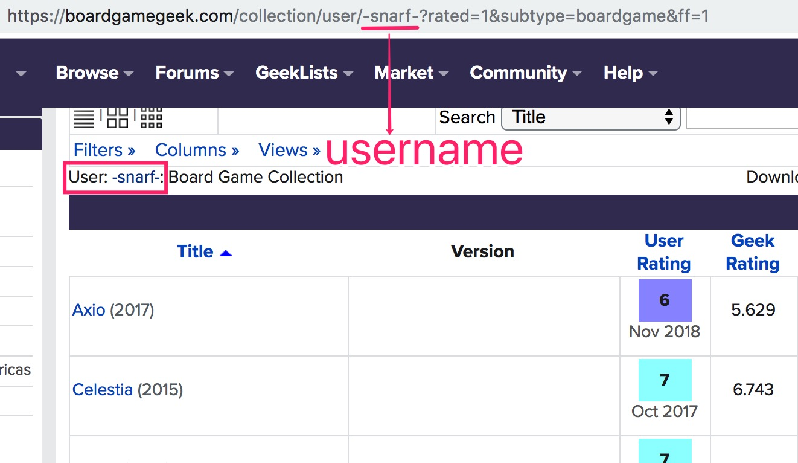

For the past few weeks, I tried to build a board game recommmender as my side project; However, I failed to beat the baseline model. Due to time limits, I had to abort this project and move on to other stuff. Netherlevess, I feel that my failure may help those who are new to recommendation system, and that is the purpose of this blog post. I will explain some techniques I (mis)used, and problems that might cause the undesirable performance. 

#### For folks who look for an ultimate solution to recommender system, this is not the right place.

### Board Games Data 

There is an [online forum](<https://boardgamegeek.com/browse/boardgame>) called BoardGameGeek (BGG) that hosts board games metadata and reviews. For example, the board game Hive has a page with detailed information such as playing time, number of Players, and weight (how difficult a game is to understand). 

BGG also provides the XML API to get all the metadata for one or more board games. Since the API call requires gameIDs as parameters, I used *BeautifulSoup* and *Requests* to scrape them from the HTML pages. 

Metadata I gathered for my recommender system include the unique game ID, game name, year published, and geek rating. 

There is a subtle difference between geek rating and average rating. The average rating may rank a game with a very few high rating before a game with lots of voters, but a slightly lower rating. The geek rating, on the other hand, takes into account the number of voters and estimates the mean of a game using Bayesian average. 

I stored all my data in MySQL, and converted them to a CSV file for data analysis. 

### Users Rating 

BGG website allows download for single user collections, but where to get a list of usernames? Luckily, I found an easy way to obtain a list of users via [BGG's Tenth Anniversary](<https://boardgamegeek.com/microbadge/13507>) . For users in the table of Related Owners, I went to their collection pages to scrape all the rating information. The image below demonstrated how the unique username leads to that person's rating page. 

To preserve hierarchical structured relationship, I stored username, game title, and user rating as a JSON object. 

Users who failed to rate at least five games were filtered out. 

The collection process inevitably introduced some biases, since users who did not log in during the month following BGG's 10th anniversary were simply absent. 

### Collaborative Filtering 

There are two main types of Collaborative Filtering: User-Based Collaborative Filtering (UBCF) and Item-Based Collaborative Filtering (IBCF). The picture below is a good explanation of their differences. 

Picture Source: <http://www.diva-portal.org/smash/get/diva2:1111865/FULLTEXT01.pdf>

To the left, the items "sun" and "cloud" are recommendations (in the half dotted lines) to user 3 based on the similar user 1; To the right, the item "sun" is recommended based on its similar item "moon". 

In an online experiment setting, the number of users usually increases faster than the number of board games, thus it makes sense to perform IBCF due to computational cost. 

On the contrary, I conducted offline experiments and chose the number of board games at least twice as that of users. I decided to go with UBCF.

### Missing Values Disaster  

The first step before carryinig UBCF was to construct the user-item rating matrix. In fact, every user only rated a tiny fraction of all games. The rated games were on a scale of 1 to 10, with 1 being "Awful" and 10 being "Outstanding". When I had 500 users and 3886 board games, only 2% of the matrix were filled with actual ratings. 

In my first attempt, I replaced all missing values with zeros and applied cosine similarity to the user vectors. The formula is as follows: 

$$sim(i,j) = cos(\vec{i},\vec{j}) = \frac{\vec{i}*\vec{j}}{\|\vec{i}\|*\|\vec{j}\|}$$

I even took care of the fact that some users might always rank a game higher than others, and added back the mean of a user in the prediction formula: 
$$
r_{ik} = \bar{r_i} + \frac{\sum_{j \in P} sim(i, j) * (r_{jk}-\bar{r_j})}{\sum_{j \in P} sim(i, j)}
$$
The second term of the right-hand side equation represents the weighted average of all the similar users (in set $P$) to person $i$ ; Together with the first term, it forms the predicted rating of user $i$ to item $k$ . 

Everything seemed reasonable, except that **I made a mistake of falsely handling the missing values.** 

Think about it, if 1 represents "dislike", 0 would just means "super dislike". In theory, the cosine similarity between two users should be based solely on their co-rated items; however, if one user has not rated one game while the other did, they become more dissimilar in that dimension as zero plays a role. 

Later, I realized my mistake and replaced the missing data with the mean rating of each user. Not being able to deal with data imputation accurately had an adverse effect on my model's performance. 

### Experiments & Evaluation 

I reserved the first 3 highest scored games of every user as training data, and the rest as test data. There were 500 users and 38488 predictions made by UBCF algorithm and baseline.

Root Mean Square Error (RMSE) is a good way to quantify the errors in recommender system. The formula is as follows: 
$$
RMSE = \sqrt{\frac{1}{\|{J}\|}\sum_{(u,i)\in J}(\widehat{r_{u,i}}-r_{u,i})^2}
$$
It is self-explanatory that RMSE would penalize large errors. For example, say my predicted rating of user $i$ for the game Hive is 8 (Very good) , but user $i$ thinks terribly of that game and only gives a 3 (Bad) , RMSE would then be $(8-3)^2=25$ (big!) . 

I also set up a baseline model which predicted constant for every user, that is, simply took the mean rating of the user as the prediction. **It turned out that the UBCF method could reach a RMSE score so close to the baseline, up to 2 decimals, but never beat the baseline. **

A t-test also confirmed that the UBCF model did not outperform the baseline. In fact, 99% of the time, it predicted the same as the baseline.

### Conclusion

My experiments showed that for recommender systems, the baseline is actually hard to beat. The [Netflix Challenge](<https://en.wikipedia.org/wiki/Netflix_Prize>) was a competition to build a recommendation system for movies; after years of effort, the best models only beat the baseline by 10%!

Data preprocessing (including how to handle missing data), although often overlooked, is an important part of the model. Meanwhile, [Matrix Factorization](<https://en.wikipedia.org/wiki/Matrix_factorization_(recommender_systems)>) is another collaboritive filtering method that works well with sparse matrix. It decomposes the matrix into one user matrix and one item matrix, while preserving more information. 

Hope that this post can help you avoid some mistakes before jumping into your own recommender system! 

